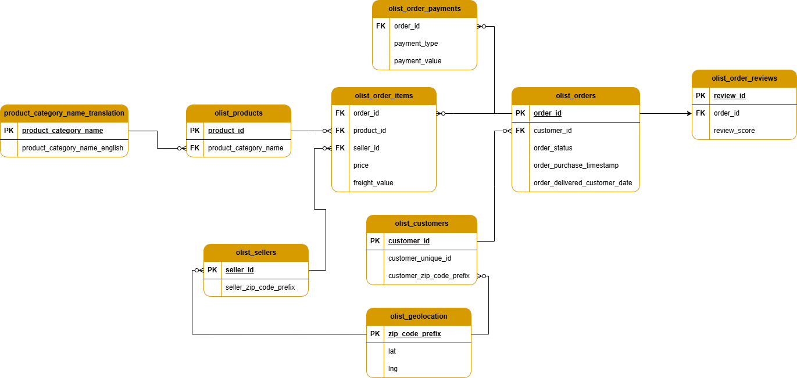
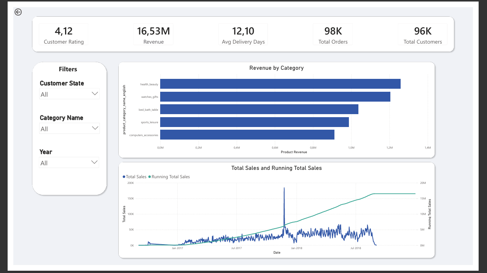
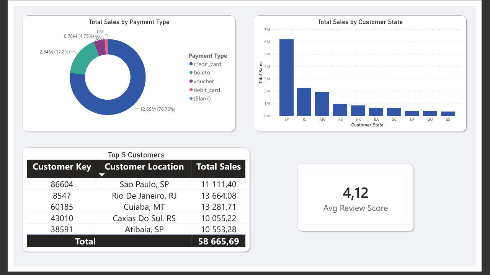
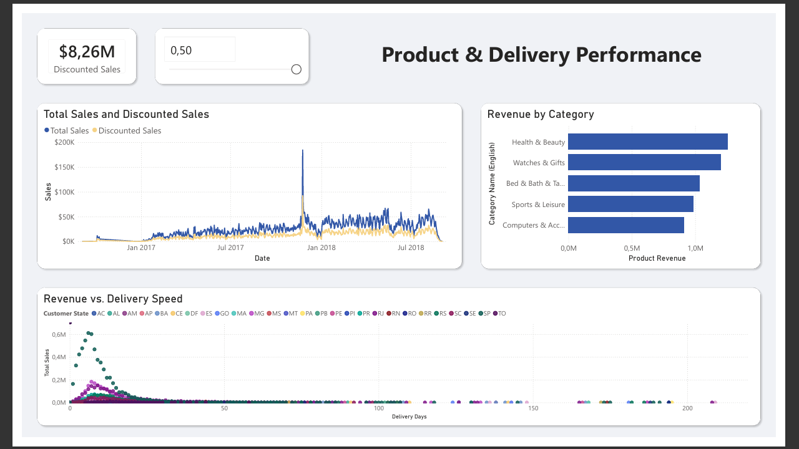

# 🛒 Olist Sales & Delivery Analytics

> An end-to-end Business Intelligence project analyzing 100k+ e-commerce orders to uncover revenue drivers, delivery bottlenecks, and customer behavior.

## 🚀 Project Overview

This project simulates a real-world data engineering and analytics workflow. I built a **Star Schema data warehouse** in PostgreSQL, performed complex ETL (Extract, Transform, Load) using Power Query, and developed an interactive Power BI dashboard to answer critical business questions for a Brazilian e-commerce marketplace.

The final dashboard empowers stakeholders to monitor KPIs, simulate discount impacts, and drill down into product/customer performance.

## 🎯 Why This Project?

- **Data Engineering**: Designed and implemented a dimensional data model (Star Schema) to optimize analytical query performance.
- **Advanced Analytics**: Wrote complex DAX measures (Running Totals, YoY Growth) and a dynamic "What-If" parameter.
- **Business Impact**: Uncovered insights that could reduce delivery times and increase customer lifetime value.

## 🛠️ Tech Stack

| Layer | Tools & Languages |
| :--- | :--- |
| **Database** | PostgreSQL (Star Schema, Surrogate Keys, Referential Integrity) |
| **ETL & Transformation** | Power Query (M Language), SQL (CTEs, Window Functions) |
| **Analytics & Modeling** | DAX (CALCULATE, FILTER, Time Intelligence) |
| **Visualization** | Power BI (Interactive Dashboards, Drill-through, Bookmarks) |
| **Version Control** | Git & GitHub |

## 🗺️ Data Model (Star Schema)

I designed an aggregated fact table (`fact_orders`) connected to dimension tables for Customers, Products, Sellers, Date, and Payment methods to ensure fast, scalable reporting.

## 📊 Dashboard Preview

| Executive Summary | Customer & Payment Analysis | Product & Delivery Performance |
| :---: | :---: | :---: |
| *Top-line KPIs & Monthly Trends* | *Geographic distribution & Top customers* | *Discount simulation & Delivery efficiency* |
|  |  |  |

## 💡 Key Insights Discovered

- **Revenue Concentration**: Credit cards account for ~74% of total payment volume, highlighting the importance of installment plans.
- **Logistics Performance**: Average delivery time is ~12 days, but states in the Southeast (SP, RJ) receive orders ~30% faster than Northern regions, suggesting a potential logistics optimization target.
- **Customer Value**: The top 5% of customers generate nearly 40% of total revenue, validating the need for a loyalty/retention program.
- **Discount Impact**: A 10% store-wide discount simulation shows a proportional decrease in revenue, indicating that volume would need to increase significantly to offset the loss.

## ⚙️ How to Reproduce

1.  **Database Setup**:
    - Install PostgreSQL and create a database named `olist`.
    - Run the `schema.sql` and `populate_tables.sql` scripts in the `/sql` folder to build the Star Schema and import the raw data.
2.  **Power BI Connection**:
    - Open the `dashboard/Power BI/retail_sales_analytics.pbix` file.
    - In Power BI, go to **File > Options and settings > Data source settings** and update the PostgreSQL server connection to point to your local instance.
3.  **Explore**:
    - Interact with the slicers to filter by year, state, and product category.

---
*Note: This dataset is publicly available from Olist via Kaggle.*
